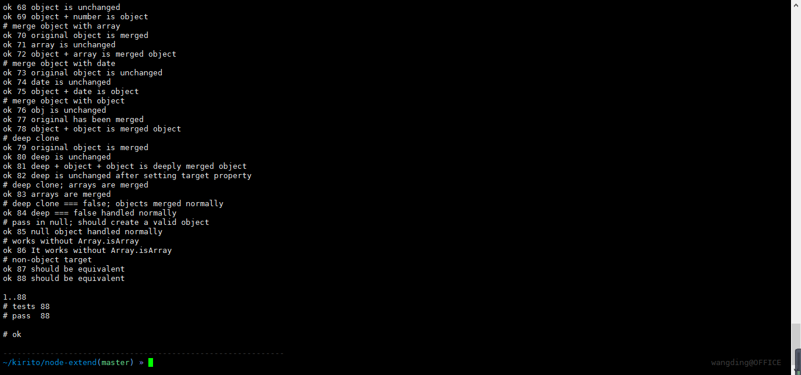

# 读代码大作业之[node-extend](https://gu-miao.github.io/node-extend/)

## 简介  
node-extend API 是一个简单轻量的第三方库代码程序，作用是基于对象来对目标添加属性以实现对于对象的拓展。

## 安装

``` sh
npm install extend
```

## 用法

**语法：** extend **(** [`deep`], `target`, `object1`, [`objectN`] **)**

*用一个或多个对象扩展一个对象，返回修改过的对象。*

**例子：**

``` js
var extend = require('extend');
extend(targetObject, object1, object2);
```

记住目标对象将被修改，并将返回extend()。

如果将 true 指定为第一个参数，则扩展执行深拷贝，递归地复制它遍历到的所有对象。否则，复制体将与原始对象共享结构。  
未定义属性不被复制。但是，从对象原型继承的属性将被复制。  
警告：不支持传递第一个参数为 false。

### 参数

* `deep` *布尔类型* （可选参数）
设置函数是否为深拷贝
* `target`	*对象类型*
要扩展的对象
* `object1`	*对象类型*
该对象会被合并到第一个对象中
* `objectN` *对象类型* （可选参数）
这些对象会被合并到第一个对象中

## 源代码解析  

源代码主要分为三个模块：isPlainObject() isArray() extend()  

### isArray()
判断函数：判断是否为数组，返回一个布尔值
### isPlainObject()  
判断函数：判断是否为对象，返回一个布尔值
### extend()
主体函数部分，对对象的属性进行复制，然后通过对象操作将属性赋给目标对象，如果被操作对象存在对象嵌套或者是多维数组，则会触发递归调用  

  

## 特点  
1.如果被操作对象与目标对象有同名属性，后添加的属性值会覆盖之前的属性值  
2.当被操作对象为 String 类型时，它会被自动转为数组类型对像来处理，但是 JSON 和 Symbol 类型则不会  
3.目标对象只支持对象和数组类型

## mocha 自动化测试
  
  
  
  

## travi CI 持续集成  


## 问题清单  

1.解读代码的思路  

```
    解读代码的最终目的是能够使用代码模块，所以我先翻译了源代码的 readme 和 changelog 明白了基本语法和作者的开发思路和代
码开发历程，然后对源代码进行了推敲并且自己写了一些 demo 来尝试 extend() 方法，最后完成了 mocha 自动化测试和持续集成。
```  

2.代码的可读性  
```
    代码的可读性很好，关键位置会有注释
    结构清楚，三大模块，主次分明
```  
3.代码程序用到的外部库
```
    tape.js       结合 mocha 使用的测试模块
    mocha         自动化测试框架
    eslint        JS代码风格检测工具
    travi CI      持续集成
```  
4.代码程序的改进
```
    1.extend() 方法会覆盖同名属性，在这一点上应该让使用者去选择
    2.extend() 方法对于 String 类型的被操作对象会将它转化为数组，例如： "hello" => ["h","e","l","l","o"] 但是这样的
存储方式显然不方便使用者来操作，或许我们可以将它改变为 "hello" => ["hello"]
    3.在第二条的基础上我们可以考虑拓宽目标对象的可选范围,比如 String, JSON, Symbol 等
```
